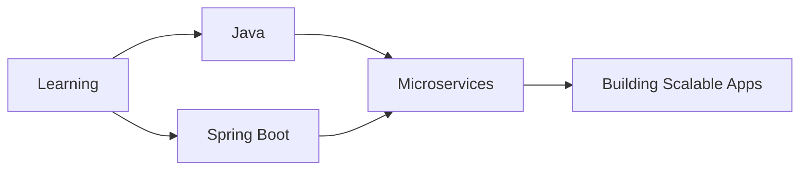

<div align="center">
  
</div>

<div align="center">
  
  
</div>

---

### 🚀 About Me

```javascript
const akshat = {
    location: "India 🇮🇳",
    currentFocus: "Java & Spring Boot",
    expertise: ["Node.js", "Express.js", "Backend Development"],
    learning: ["System Design", "Microservices", "Cloud Architecture"],
    funFact: "I think I look cool.. 😎",
    askMeAbout: ["Backend Dev", "API Design", "Database Optimization"]
};
```

---

### 💻 Tech Stack

<div align="center">

#### 🎨 Frontend


#### ⚙️ Backend


#### 🗄️ Databases


#### 🛠️ Tools


</div>

---

### 📊 GitHub Stats

<div align="center">
  
  
</div>

<div align="center">
  
</div>

<div align="center">
  
</div>

---

### 🏆 Competitive Programming

<div align="center">
  
[](https://www.leetcode.com/aksh_at)
[](https://auth.geeksforgeeks.org/user/akshatyxon)

</div>

---

### 🎯 Current Focus



---

### 📫 Connect With Me

<div align="center">
  
[](mailto:akshatbit22@gmail.com)
[](https://www.leetcode.com/aksh_at)
[](https://auth.geeksforgeeks.org/user/akshatyxon)

</div>

---

<div align="center">
  
</div>
